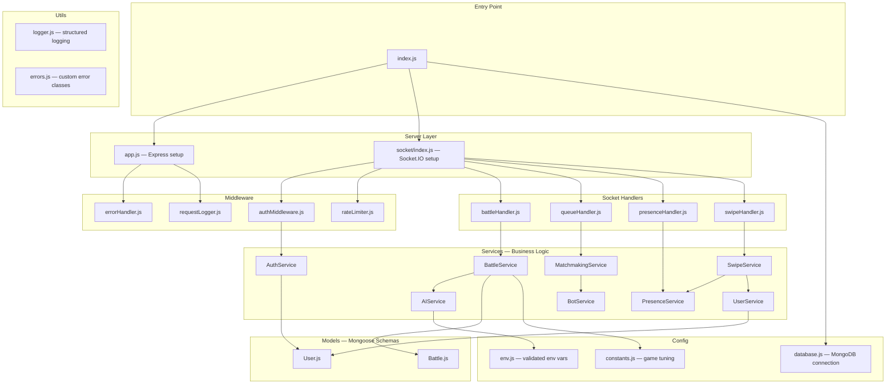
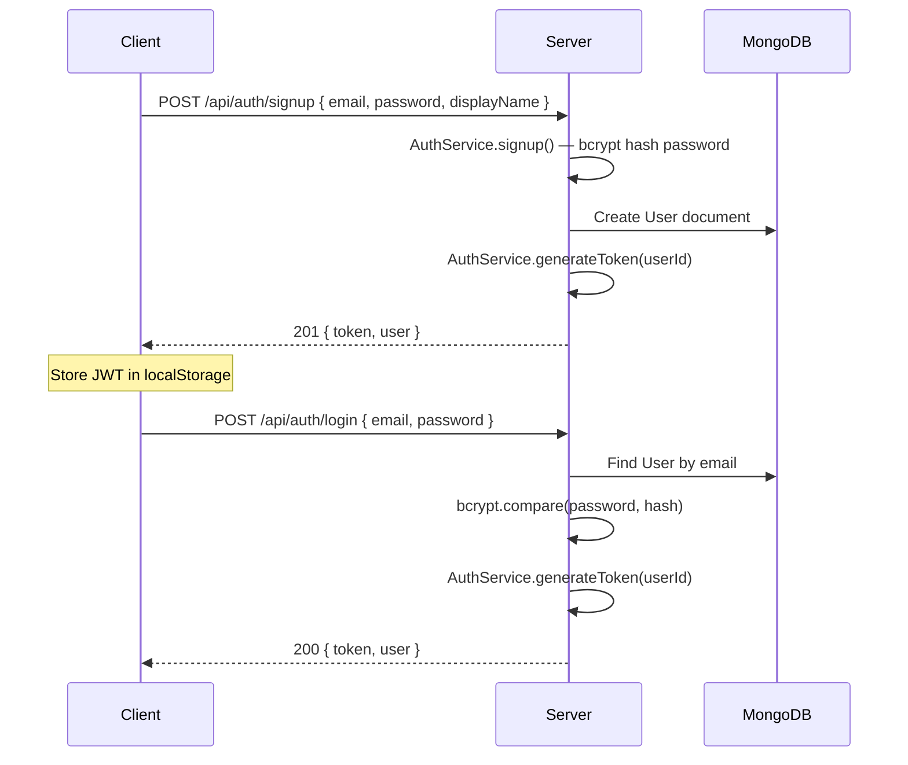
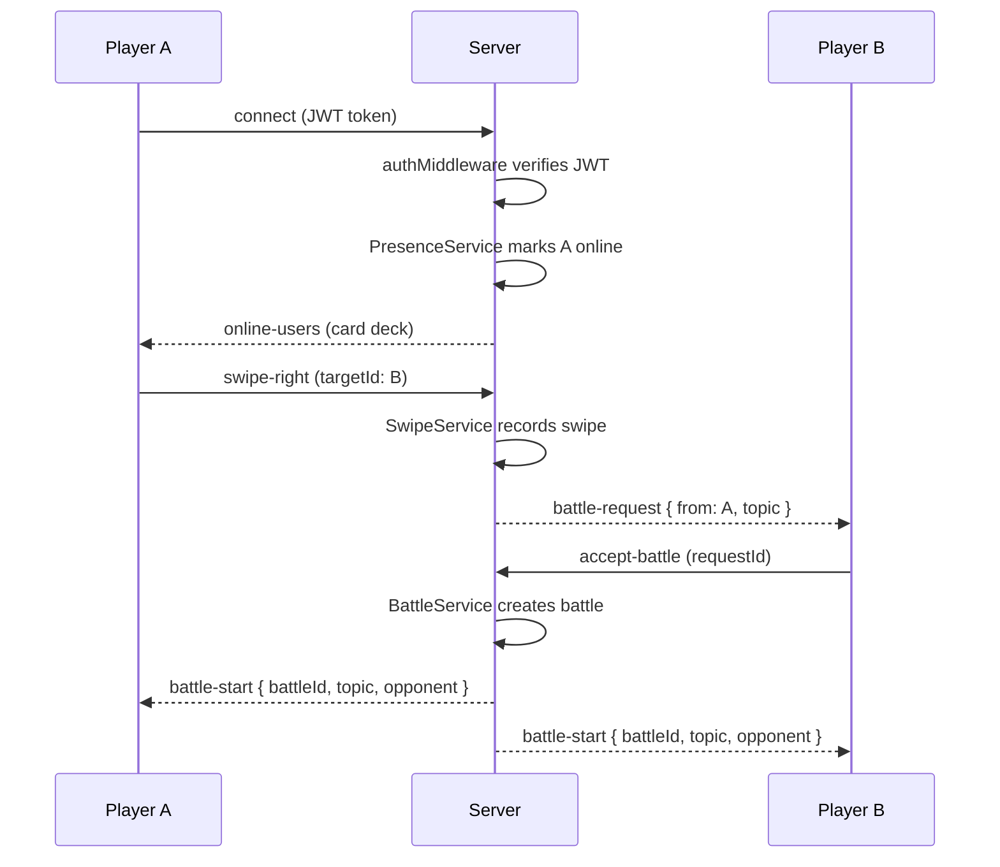
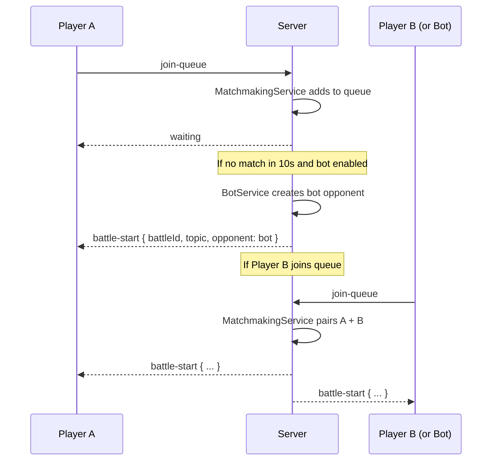
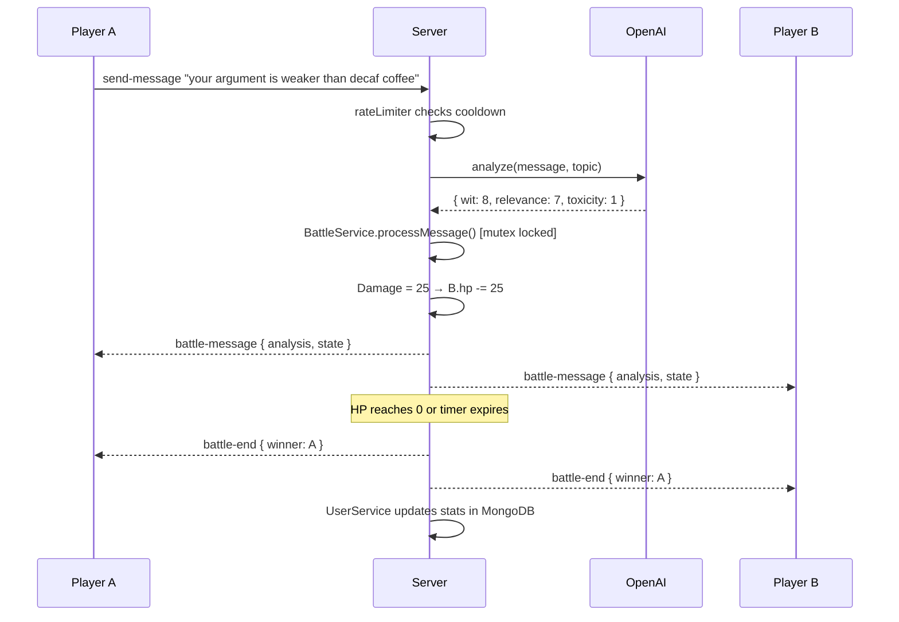

# BattleBrain Backend — Architecture

## Overview

BattleBrain is a gamified AI-moderated debate platform where players engage in real-time "meme battles." Users create accounts, browse online opponents via a **Tinder-style swipe interface**, send battle requests, and fight in real-time debates where AI scores every message for wit, relevance, and toxicity.

The backend is a **Node.js + Express + Socket.IO** server with **MongoDB** (via Mongoose) for data persistence, **JWT + bcrypt** for authentication, and **OpenAI** for AI-powered message analysis.

This document describes the industry-standard layered architecture used for the backend.

---

## Architecture Diagram



---

## File Structure

```
backend/
├── src/
│   ├── index.js                  # Entry point — boots server, connects MongoDB, graceful shutdown
│   ├── app.js                    # Express app — CORS, auth routes, health route, error middleware
│   ├── config/
│   │   ├── env.js                # Validated environment variables (fail-fast)
│   │   ├── constants.js          # Game constants — HP, timers, damage formulas, topics
│   │   └── database.js           # MongoDB connection via Mongoose
│   ├── models/
│   │   ├── User.js               # Mongoose schema — user profiles, credentials, stats
│   │   └── Battle.js             # Mongoose schema — battle history, results, replays
│   ├── middleware/
│   │   ├── authMiddleware.js     # JWT token verification (Socket.IO + HTTP)
│   │   ├── errorHandler.js       # Centralized Express error handler
│   │   ├── rateLimiter.js        # Socket.IO per-player message throttling
│   │   └── requestLogger.js      # HTTP request logging
│   ├── services/
│   │   ├── AuthService.js        # JWT generation/verification, bcrypt password hashing, signup/login
│   │   ├── UserService.js        # User profiles — CRUD, stats, display name, avatar (MongoDB)
│   │   ├── PresenceService.js    # Online/offline tracking — heartbeats, presence list
│   │   ├── SwipeService.js       # Tinder-style card deck — generates cards, tracks swipes, triggers battle requests
│   │   ├── AIService.js          # OpenAI integration + fallback + JSON safety
│   │   ├── BattleService.js      # Battle state machine (class-based, mutex-locked)
│   │   ├── MatchmakingService.js # Player queue + auto-match + bot fallback timer
│   │   └── BotService.js         # AI bot opponent for solo/demo mode
│   ├── socket/
│   │   ├── index.js              # Socket.IO server init + auth middleware + handler registration
│   │   ├── battleHandler.js      # 'send-message' handler (thin — delegates to BattleService)
│   │   ├── queueHandler.js       # 'join-queue' / disconnect handler (thin — delegates to MatchmakingService)
│   │   ├── presenceHandler.js    # 'go-online' / 'go-offline' / heartbeat / presence list
│   │   └── swipeHandler.js       # 'get-cards' / 'swipe-right' / 'swipe-left' / 'accept-battle' / 'decline-battle'
│   └── utils/
│       ├── logger.js             # Structured logger (pino) — JSON in prod, pretty in dev
│       └── errors.js             # Custom error classes (AppError, ValidationError, AIServiceError)
├── .env.example                  # Documented env var template
├── .eslintrc.json                # ESLint config
├── package.json                  # Dependencies and scripts
├── nodemon.json                  # Dev server config (watches src/)
├── ARCHITECTURE.md               # This file
├── API.md                        # Full API documentation for frontend developers
└── README.md                     # Setup & usage instructions
```

---

## Core User Flows

### 1. Auth Flow (Signup / Login)



### 2. Swipe-to-Battle Flow



### 3. Quick Match Flow (Queue)



### 4. Battle Flow



---

## Layer Descriptions

### 1. Config Layer (`src/config/`)

| File | Purpose |
|------|---------|
| `env.js` | Loads and **validates** all environment variables at boot. Crashes immediately if required vars are missing — **fail fast**. Exports a frozen config object. |
| `constants.js` | All game-tuning values in one place: `INITIAL_HP`, `BATTLE_DURATION_MS`, `MAX_MESSAGE_LENGTH`, `MESSAGE_COOLDOWN_MS`, `BOT_MATCH_TIMEOUT_MS`, `PRESENCE_HEARTBEAT_INTERVAL_MS`, `SWIPE_DECK_SIZE`, damage formula config, and the `TOPICS` array. |
| `database.js` | Connects to **MongoDB** via Mongoose using `MONGODB_URI`. Handles connection events (connected, error, disconnected) and logs them. Exports the Mongoose connection for graceful shutdown. |

### 2. Models Layer (`src/models/`)

Mongoose schemas and models for MongoDB collections.

| Model | Collection | Description |
|-------|-----------|-------------|
| **User** | `users` | User profiles with email, hashed password, display name, avatar, bio, battle stats (wins, losses, streaks, average scores), and timestamps. Indexed on `email` (unique). |
| **Battle** | `battles` | Battle history with topic, player references, final HP, message count, winner, and duration. Used for replay/history features. |

### 3. Service Layer (`src/services/`)

All business logic lives here. Services are class-based for encapsulation and testability.

#### Auth & User Services

| Service | Responsibility |
|---------|---------------|
| **AuthService** | Handles signup and login. Hashes passwords with **bcrypt**, generates **JWT** tokens (signed with `JWT_SECRET`, expires per `JWT_EXPIRES_IN`), and verifies tokens. Uses the `User` model in MongoDB. |
| **UserService** | Manages user profiles in **MongoDB** via the `User` model. CRUD for display name, avatar, and bio. Tracks battle stats (wins, losses, total battles, average wit score). Creates profile on signup. Updates stats after each battle. |

#### Social & Matchmaking Services

| Service | Responsibility |
|---------|---------------|
| **PresenceService** | Tracks online/offline status. Maintains an in-memory `Map` of online users (keyed by user ID). Handles heartbeats (client pings every 30s, server marks offline after 60s silence). Emits `user-online` / `user-offline` events to all connected clients. |
| **SwipeService** | Powers the Tinder-style card deck. `getCards(userId)` returns a shuffled list of online users (excluding self and already-swiped users) with their profile data from MongoDB. `swipeRight(fromId, toId)` records a battle request. If both users swipe right on each other, it's a **mutual match** and a battle auto-starts. `swipeLeft` records a skip. |
| **MatchmakingService** | Manages the random queue for quick matches. Pairs players when 2 are waiting. Starts a **bot fallback timer** — if a player waits > 10s, auto-matches with a BotService opponent. Cleans up on disconnect. |
| **BotService** | Simulates an opponent for solo play / demos. Sends random witty messages on a 5–10s interval. Can be toggled via `ENABLE_BOT` env var. |

#### Battle & AI Services

| Service | Responsibility |
|---------|---------------|
| **AIService** | Wraps OpenAI API. Uses `gpt-4o-mini` with `response_format: { type: "json_object" }` for guaranteed JSON. Includes try/catch with automatic fallback to keyword-based analysis. Exposes `analyze(message, topic)` → `{ wit, relevance, toxicity, damage, strikeType }`. |
| **BattleService** | State machine per battle. Each `Battle` instance manages HP, messages, and timers. Uses **async-mutex** on `processMessage()` to prevent race conditions. Has an `ended` guard flag so `endBattle()` can't fire twice. On battle end, saves result to MongoDB via the `Battle` model and calls `UserService.updateStats()` for both players. |

### 4. Socket Layer (`src/socket/`)

**Thin handlers only** — no business logic. Validate input → delegate to service → emit result.

| File | Events Handled |
|------|---------------|
| `index.js` | Socket.IO server creation, CORS config, **`authMiddleware`** on connection (every socket must provide a JWT token), rate limiter, handler registration. |
| `presenceHandler.js` | `go-online` — marks user online via PresenceService. `go-offline` — marks offline. `heartbeat` — keeps presence alive. |
| `swipeHandler.js` | `get-cards` — returns shuffled deck of online users. `swipe-right` — sends battle request to target. `swipe-left` — skips user. `accept-battle` / `decline-battle` — responds to incoming request. |
| `battleHandler.js` | `send-message` — validates message length/cooldown, calls `BattleService.processMessage()`, emits `battle-message` with analysis + updated HP to the battle room. |
| `queueHandler.js` | `join-queue` — delegates to `MatchmakingService.addToQueue()`. `disconnect` — removes from queue, forfeits active battle, marks presence offline. |

### 5. Middleware Layer (`src/middleware/`)

| File | Purpose |
|------|---------|
| `authMiddleware.js` | **Required on every Socket.IO connection.** Extracts the JWT from the handshake `auth` object, verifies it via `AuthService.verifyToken()`, and attaches `socket.user = { id, email, displayName }`. Rejects unauthenticated connections. Also exports an Express middleware version for HTTP routes. |
| `errorHandler.js` | Centralized Express error handler. Returns structured JSON `{ error: { message, code, status } }`. Logs full stack server-side, returns safe message to client. |
| `rateLimiter.js` | Socket.IO middleware enforcing per-player message cooldown (default 3s) and max message length (280 chars). Emits `rate-limited` event to client. |
| `requestLogger.js` | Logs HTTP requests with method, path, status code, and response time. |

### 6. Utils Layer (`src/utils/`)

| File | Purpose |
|------|---------|
| `logger.js` | Structured logger using **pino**. JSON output in production, pretty-printed in development. Log level configurable via `LOG_LEVEL` env var. |
| `errors.js` | Custom error classes: `AppError` (base), `ValidationError`, `AIServiceError`, `AuthError`. |

### 7. Server Entry Point

| File | Purpose |
|------|---------|
| `index.js` | Loads `.env`, validates config, connects to MongoDB, creates Express app + HTTP server + Socket.IO server, starts listening. **Graceful shutdown** on `SIGTERM`/`SIGINT` — closes Socket.IO, then HTTP server, then MongoDB connection. |
| `app.js` | Express app setup: CORS, JSON body parsing, auth routes (`/api/auth/signup`, `/api/auth/login`), `GET /health` endpoint, request logger, error handler. |

---

## Data Models (MongoDB / Mongoose)

### User Schema

```javascript
{
  email:       { type: String, required: true, unique: true, lowercase: true, index: true },
  password:    { type: String, required: true, select: false },  // bcrypt hash, excluded from queries by default
  displayName: { type: String, required: true },
  avatarUrl:   { type: String, default: '' },
  bio:         { type: String, default: '', maxlength: 200 },
  stats: {
    totalBattles:    { type: Number, default: 0 },
    wins:            { type: Number, default: 0 },
    losses:          { type: Number, default: 0 },
    avgWitScore:     { type: Number, default: 0 },
    avgToxicityScore:{ type: Number, default: 0 },
    winStreak:       { type: Number, default: 0 },
    longestWinStreak:{ type: Number, default: 0 }
  },
  createdAt: { type: Date, default: Date.now },
  lastSeen:  { type: Date, default: Date.now }
}
```

### Battle Schema

```javascript
{
  topic:    { type: String, required: true },
  players: [{
    user:      { type: Schema.Types.ObjectId, ref: 'User' },
    finalHp:   { type: Number },
    messages:  { type: Number }
  }],
  winner:   { type: Schema.Types.ObjectId, ref: 'User' },
  duration: { type: Number },  // milliseconds
  createdAt:{ type: Date, default: Date.now }
}
```

---

## Key Design Decisions

| Decision | Rationale |
|----------|-----------|
| **Layered architecture** (config → models → services → handlers → server) | Clear dependency flow; each layer testable in isolation |
| **MongoDB + Mongoose** | Flexible document schema fits user profiles and battle history well; Mongoose provides schema validation, middleware hooks, and easy population of references |
| **JWT + bcrypt** (no third-party auth) | Full control over auth flow; no external dependencies; JWT is stateless and works naturally with Socket.IO handshake; bcrypt is industry standard for password hashing |
| **Tinder-style swipe → battle request** | Social discovery layer; more engaging than random queue; users choose their opponents |
| **Presence via in-memory Map + heartbeat** | Low-latency online status; heartbeat catches zombie connections that didn't fire disconnect |
| **Swipe-right mutual match** | If both users swipe right on each other, battle auto-starts — gamified social mechanic |
| **Class-based services** | Encapsulate per-battle state; easy to instantiate, mock, and test |
| **Thin socket handlers** | Handlers only validate + route; business logic lives in services |
| **Mutex on battle state** | Prevents race conditions from concurrent async AI calls modifying HP |
| **Bot fallback** | Demo never breaks even with 0 other users online |
| **`response_format: json_object`** | Eliminates fragile `JSON.parse` on LLM free-text output |
| **`gpt-4o-mini` over `gpt-4`** | ~10x faster response time, ~20x cheaper, sufficient quality for scoring |

---

## Tech Stack

| Category | Technology |
|----------|-----------|
| Runtime | Node.js |
| HTTP Framework | Express |
| WebSockets | Socket.IO |
| Database | MongoDB (via Mongoose) |
| Auth | JWT (jsonwebtoken) + bcrypt |
| AI | OpenAI SDK (`gpt-4o-mini`) |
| Logging | pino + pino-pretty |
| Concurrency | async-mutex |
| Linting | ESLint |
| Dev Server | nodemon |

---

## Environment Variables

| Variable | Required | Default | Description |
|----------|----------|---------|-------------|
| `PORT` | No | `3000` | Server port |
| `NODE_ENV` | No | `development` | Environment mode |
| `OPENAI_API_KEY` | **Yes** | — | OpenAI API key |
| `MONGODB_URI` | **Yes** | — | MongoDB connection string |
| `JWT_SECRET` | **Yes** | — | Secret key for signing JWT tokens |
| `JWT_EXPIRES_IN` | No | `7d` | JWT token expiry duration |
| `FRONTEND_URL` | No | `http://localhost:5173` | Allowed CORS origin |
| `LOG_LEVEL` | No | `debug` | Logging verbosity |
| `ENABLE_BOT` | No | `true` | Enable bot opponent fallback |
| `PRESENCE_HEARTBEAT_INTERVAL_MS` | No | `30000` | How often clients should ping |
| `PRESENCE_TIMEOUT_MS` | No | `60000` | Mark offline after this silence |
| `SWIPE_DECK_SIZE` | No | `20` | Max cards returned per deck request |

---

## API Endpoints

### HTTP

| Method | Path | Description |
|--------|------|-------------|
| `POST` | `/api/auth/signup` | Create account — returns JWT |
| `POST` | `/api/auth/login` | Log in — returns JWT |
| `GET` | `/health` | Health check |

### Socket.IO Events

#### Client → Server

| Event | Payload | Description |
|-------|---------|-------------|
| `go-online` | — | Mark self as online (called after connecting) |
| `heartbeat` | — | Keep presence alive (send every 30s) |
| `get-cards` | — | Request deck of online users to swipe on |
| `swipe-right` | `{ targetId }` | Send battle request to a user |
| `swipe-left` | `{ targetId }` | Skip a user (won't appear again this session) |
| `accept-battle` | `{ requestId }` | Accept an incoming battle request |
| `decline-battle` | `{ requestId }` | Decline an incoming battle request |
| `join-queue` | — | Enter the random matchmaking queue |
| `send-message` | `string` (message text) | Send a debate message during battle |

#### Server → Client

| Event | Payload | Description |
|-------|---------|-------------|
| `online-users` | `[{ id, displayName, avatar, stats }]` | Card deck of swipeable users |
| `user-online` | `{ id, displayName }` | A user came online |
| `user-offline` | `{ id }` | A user went offline |
| `battle-request` | `{ requestId, from: { id, displayName, stats }, topic }` | Incoming battle request |
| `battle-request-declined` | `{ requestId, by }` | Your request was declined |
| `waiting` | — | In queue, waiting for opponent |
| `battle-start` | `{ battleId, topic, opponent }` | Battle matched, topic assigned |
| `battle-message` | `{ senderId, message, analysis, state }` | Message analyzed, HP updated |
| `battle-end` | `{ winner, finalState }` | Battle is over |
| `rate-limited` | `{ cooldownRemaining }` | Message rejected (too fast) |
