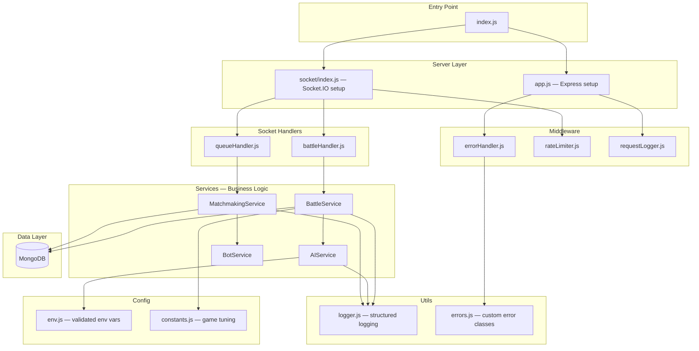

# BattleBrain Backend — Architecture

## Overview

BattleBrain is a gamified AI-moderated debate platform where players engage in real-time "meme battles." The backend is a **Node.js + Express + Socket.IO** server that manages matchmaking, real-time battle state, AI-powered message analysis via GPT-oss 120b, and persistent data storage with **MongoDB**.

This document describes the industry-standard layered architecture used for the backend.

---

## Architecture Diagram



---

## File Structure

```
backend/
├── src/
│   ├── index.js                  # Entry point — boots server, graceful shutdown
│   ├── app.js                    # Express app — CORS, health route, error middleware
│   ├── config/
│   │   ├── env.js                # Validated environment variables (fail-fast)
│   │   └── constants.js          # Game constants — HP, timers, damage formulas, topics
│   ├── middleware/
│   │   ├── errorHandler.js       # Centralized Express error handler
│   │   ├── rateLimiter.js        # Socket.IO per-player message throttling
│   │   └── requestLogger.js      # HTTP request logging
│   ├── services/
│   │   ├── AIService.js          # OpenAI integration + fallback + JSON safety
│   │   ├── BattleService.js      # Battle state machine (class-based, mutex-locked)
│   │   ├── MatchmakingService.js # Player queue + auto-match + bot fallback timer
│   │   └── BotService.js         # AI bot opponent for solo/demo mode
│   ├── socket/
│   │   ├── index.js              # Socket.IO server init + middleware pipeline
│   │   ├── battleHandler.js      # 'send-message' handler (thin — delegates to BattleService)
│   │   └── queueHandler.js       # 'join-queue' / disconnect handler (thin — delegates to MatchmakingService)
│   └── utils/
│       ├── logger.js             # Structured logger (pino) — JSON in prod, pretty in dev
│       └── errors.js             # Custom error classes (AppError, ValidationError, AIServiceError)
├── .env.example                  # Documented env var template
├── .eslintrc.json                # ESLint config
├── package.json                  # Dependencies and scripts
├── nodemon.json                  # Dev server config (watches src/)
├── BACKEND_ARCHITECTURE.md       # This file
└── README.md                     # Setup & usage instructions
```

---

## Layer Descriptions

### 1. Config Layer (`src/config/`)

| File | Purpose |
|------|---------|
| `env.js` | Loads and **validates** all environment variables at boot. Crashes immediately if required vars (like `OPENAI_API_KEY`) are missing — **fail fast** instead of mysterious runtime errors. Exports a frozen config object. |
| `constants.js` | All game-tuning values in one place: `INITIAL_HP`, `BATTLE_DURATION_MS`, `MAX_MESSAGE_LENGTH`, `MESSAGE_COOLDOWN_MS`, `BOT_MATCH_TIMEOUT_MS`, damage formula config, and the `TOPICS` array. Nothing is hardcoded in business logic. |

### 2. Service Layer (`src/services/`)

This is where **all business logic** lives. Services are class-based for encapsulation and testability.

| Service | Responsibility |
|---------|---------------|
| **AIService** | Wraps OpenAI API. Uses `gpt-oss-120b` with `response_format: { type: "json_object" }` for guaranteed JSON. Includes try/catch with automatic fallback to keyword-based analysis. Exposes `analyze(message, topic)` → `{ wit, relevance, toxicity, damage, strikeType }`. |
| **BattleService** | State machine per battle. Each `Battle` instance manages HP, messages, and timers. Uses **async-mutex** on `processMessage()` to prevent race conditions from concurrent AI calls updating HP simultaneously. Has an `ended` guard flag so `endBattle()` can't fire twice (timer + HP=0 race). Emits domain events rather than touching Socket.IO directly. |
| **MatchmakingService** | Manages the player queue. Pairs players when 2 are waiting. Starts a **bot fallback timer** — if a player waits > 10s, auto-matches them with a BotService opponent. Cleans up queue entries on disconnect. |
| **BotService** | Simulates an opponent for solo play / demos. Sends random witty messages on a 5–10s interval. Can be toggled via `ENABLE_BOT` env var. |

### 3. Socket Layer (`src/socket/`)

**Thin handlers only** — no business logic. Each handler validates input, delegates to the appropriate service, and emits results to the Socket.IO room.

| File | Events Handled |
|------|---------------|
| `index.js` | Socket.IO server creation, CORS config (locked to `FRONTEND_URL`, not `*`), middleware pipeline (rate limiter), handler registration. |
| `battleHandler.js` | `send-message` — validates message length/cooldown, calls `BattleService.processMessage()`, emits `battle-message` with analysis + updated HP to the battle room. |
| `queueHandler.js` | `join-queue` — delegates to `MatchmakingService.addToQueue()`. `disconnect` — removes from queue, forfeits active battle. |

### 4. Middleware Layer (`src/middleware/`)

| File | Purpose |
|------|---------|
| `errorHandler.js` | Centralized Express error handler. Returns structured JSON `{ error: { message, code, status } }`. Logs full stack server-side, returns safe message to client. Different verbosity in dev vs prod. |
| `rateLimiter.js` | Socket.IO middleware enforcing per-player message cooldown (default 3s) and max message length (280 chars). Emits `rate-limited` event to client with remaining cooldown. |
| `requestLogger.js` | Logs HTTP requests with method, path, status code, and response time using the structured logger. |

### 5. Utils Layer (`src/utils/`)

| File | Purpose |
|------|---------|
| `logger.js` | Structured logger using **pino**. JSON output in production (parseable by log aggregators), pretty-printed in development. Log level configurable via `LOG_LEVEL` env var. Replaces all `console.log`/`console.error`. |
| `errors.js` | Custom error classes: `AppError` (base), `ValidationError`, `AIServiceError`. Allows the error handler to differentiate error types and respond with appropriate HTTP status codes. |

### 6. Server Entry Point

| File | Purpose |
|------|---------|
| `index.js` | Loads `.env`, validates config, creates Express app + HTTP server + Socket.IO server, starts listening. Implements **graceful shutdown** on `SIGTERM`/`SIGINT` — closes Socket.IO connections first, then HTTP server, then exits. |
| `app.js` | Express app setup: CORS (env-specific origin), JSON body parsing, `GET /health` endpoint (returns `{ status: "ok", uptime, timestamp }`), request logger, error handler (last in chain). |

---

## Key Design Decisions

| Decision | Rationale |
|----------|-----------|
| **Layered architecture** (config → services → handlers → server) | Clear dependency flow; each layer testable in isolation |
| **Class-based services** | Encapsulate per-battle state; easy to instantiate, mock, and test |
| **Thin socket handlers** | Handlers only validate + route; business logic lives in services |
| **Mutex on battle state** | Prevents race conditions from concurrent async AI calls modifying HP |
| **Fail-fast config validation** | Catches missing env vars at boot, not at random runtime moments |
| **Centralized error handling** | One place defines error response format; no scattered try/catches |
| **Structured logging (pino)** | JSON logs are grep-able and parseable by log aggregators (Datadog, etc.) |
| **Bot fallback** | Demo never breaks even with 0 other users online |
| **`response_format: json_object`** | Eliminates fragile `JSON.parse` on LLM free-text output |
| **`gpt-oss-120b`** | Open-source 120B parameter model — strong enough for wit/toxicity scoring, cost-effective, self-hostable |

---

## Tech Stack

| Category | Technology |
|----------|-----------|
| Runtime | Node.js |
| HTTP Framework | Express |
| WebSockets | Socket.IO |
| AI | OpenAI SDK (`gpt-oss-120b`) |
| Database | MongoDB (Mongoose ODM) |
| Logging | pino + pino-pretty |
| Concurrency | async-mutex |
| Linting | ESLint |
| Dev Server | nodemon |

---

## Environment Variables

| Variable | Required | Default | Description |
|----------|----------|---------|-------------|
| `PORT` | No | `3000` | Server port |
| `NODE_ENV` | No | `development` | Environment mode |
| `OPENAI_API_KEY` | **Yes** | — | OpenAI-compatible API key (for GPT-oss 120b) |
| `MONGODB_URI` | **Yes** | — | MongoDB connection string |
| `FRONTEND_URL` | No | `http://localhost:5173` | Allowed CORS origin |
| `LOG_LEVEL` | No | `debug` | Logging verbosity |
| `ENABLE_BOT` | No | `true` | Enable bot opponent fallback |

---

## API Endpoints

### HTTP

| Method | Path | Description |
|--------|------|-------------|
| `GET` | `/health` | Health check — returns `{ status, uptime, timestamp }` |

### Socket.IO Events

#### Client → Server

| Event | Payload | Description |
|-------|---------|-------------|
| `join-queue` | — | Enter the matchmaking queue |
| `send-message` | `string` (message text) | Send a debate message during battle |

#### Server → Client

| Event | Payload | Description |
|-------|---------|-------------|
| `waiting` | — | Player is in queue, waiting for opponent |
| `battle-start` | `{ battleId, topic, opponent }` | Battle matched, topic assigned |
| `battle-message` | `{ senderId, message, analysis, state }` | Message analyzed, HP updated |
| `battle-end` | `{ winner, finalState }` | Battle is over |
| `rate-limited` | `{ cooldownRemaining }` | Message rejected (too fast) |
