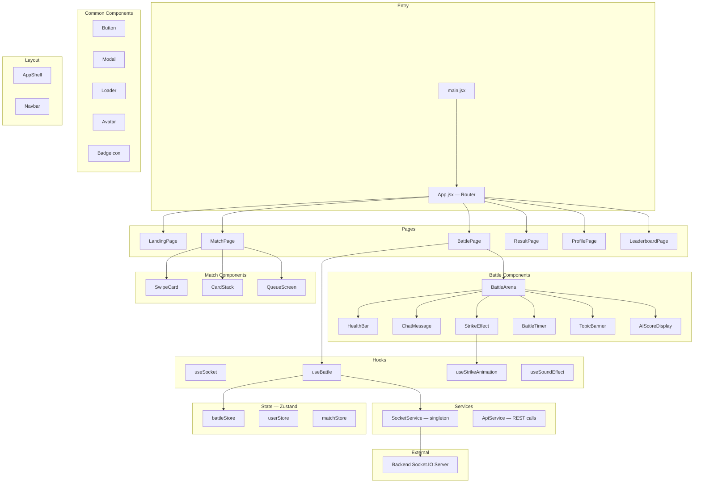
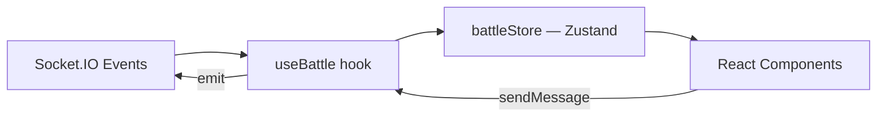
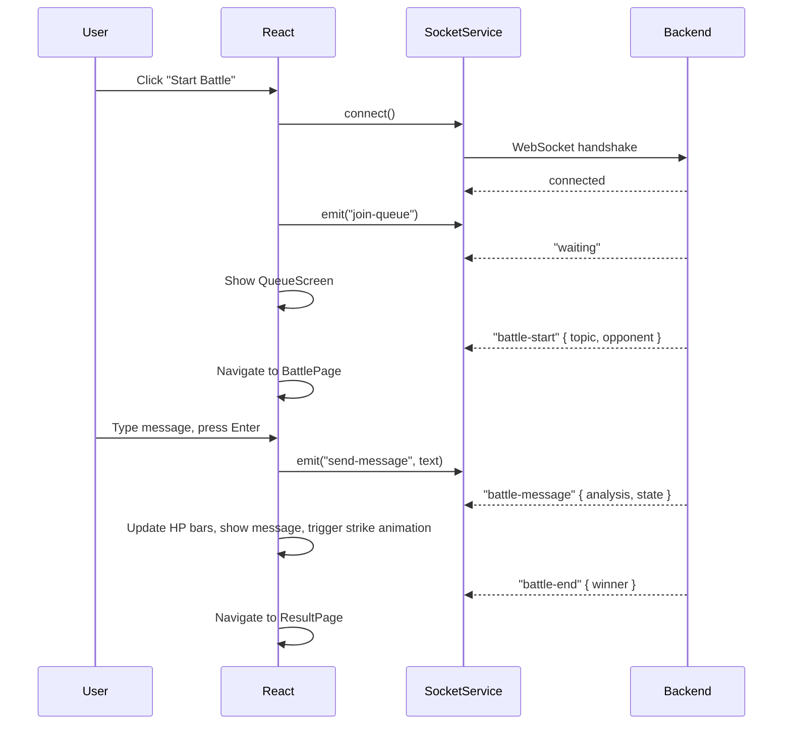

# BattleBrain Frontend — Architecture

## Overview

BattleBrain's frontend is a **React 19 SPA** built with **Vite 6**. It provides the gamified battle UI — swipe-to-match, real-time debate arena with animated HP bars, AI scoring displays, and rich strike effects. The app communicates with the backend exclusively via **Socket.IO** for real-time events and via REST for non-realtime data (leaderboards, history).

---

## Architecture Diagram



---

## File Structure

```
frontend/
├── public/
│   └── favicon.svg                         # App icon
├── src/
│   ├── assets/
│   │   ├── images/                         # Logos, backgrounds, meme assets
│   │   └── sounds/                         # Strike SFX, victory fanfare, ambient
│   ├── components/
│   │   ├── common/                         # Reusable primitives
│   │   │   ├── Button.jsx                  # Styled button with variants
│   │   │   ├── Modal.jsx                   # Animated modal (Framer Motion)
│   │   │   ├── Loader.jsx                  # Spinner / skeleton loader
│   │   │   ├── Avatar.jsx                  # User avatar component
│   │   │   └── BadgeIcon.jsx               # Achievement badge display
│   │   ├── battle/                         # Battle Arena components
│   │   │   ├── BattleArena.jsx             # Main arena container
│   │   │   ├── HealthBar.jsx               # Animated HP bar (Framer Motion)
│   │   │   ├── ChatMessage.jsx             # Message bubble + strike indicator
│   │   │   ├── StrikeEffect.jsx            # GSAP-powered hit animation
│   │   │   ├── BattleTimer.jsx             # Countdown timer display
│   │   │   ├── TopicBanner.jsx             # Debate topic header
│   │   │   ├── AIScoreDisplay.jsx          # Wit/relevance/toxicity meters
│   │   │   └── DamageNumber.jsx            # Floating damage indicator (GSAP)
│   │   ├── match/                          # Matching flow components
│   │   │   ├── SwipeCard.jsx               # Tinder-style profile card
│   │   │   ├── CardStack.jsx               # Draggable card stack
│   │   │   └── QueueScreen.jsx             # "Searching for opponent" animation
│   │   └── layout/                         # App-level layout
│   │       ├── AppShell.jsx                # Root layout wrapper
│   │       └── Navbar.jsx                  # Navigation bar
│   ├── hooks/
│   │   ├── useSocket.js                    # Socket.IO connection lifecycle
│   │   ├── useBattle.js                    # Battle state + event handlers
│   │   ├── useStrikeAnimation.js           # GSAP animation triggers
│   │   └── useSoundEffect.js              # Howler.js audio playback
│   ├── pages/
│   │   ├── LandingPage.jsx                 # Hero + CTA + concept explainer
│   │   ├── MatchPage.jsx                   # Swipe interface / quick match
│   │   ├── BattlePage.jsx                  # Full battle arena view
│   │   ├── ResultPage.jsx                  # Post-battle stats + replay
│   │   ├── ProfilePage.jsx                 # User stats, badges, history
│   │   └── LeaderboardPage.jsx             # Top players ranking
│   ├── services/
│   │   ├── SocketService.js                # Socket.IO client singleton
│   │   └── ApiService.js                   # REST API helper (fetch/axios)
│   ├── stores/
│   │   ├── battleStore.js                  # Zustand — battle state (HP, messages, timer)
│   │   ├── userStore.js                    # Zustand — user profile, XP, badges
│   │   └── matchStore.js                   # Zustand — matchmaking queue state
│   ├── styles/
│   │   ├── index.css                       # TailwindCSS v4 imports + custom properties
│   │   └── animations.css                  # Keyframe animations for CSS-only effects
│   ├── utils/
│   │   ├── constants.js                    # Frontend constants (colors, timing, breakpoints)
│   │   ├── formatters.js                   # HP display, time formatting, score rounding
│   │   └── sounds.js                       # Sound asset registry
│   ├── App.jsx                             # React Router setup
│   └── main.jsx                            # Vite entry point
├── index.html                              # Vite HTML template
├── package.json                            # Dependencies & scripts
├── vite.config.js                          # Vite configuration
├── FRONTEND_ARCHITECTURE.md                # This file
└── README.md                               # Frontend setup instructions
```

---

## Layer Descriptions

### 1. Pages (`src/pages/`)

Route-level components — each maps to one URL path. Pages compose layout wrappers and feature-specific components. They are thin orchestrators; business logic belongs in hooks and stores.

| Page | Route | Responsibility |
|------|-------|---------------|
| `LandingPage` | `/` | Hero section, animated title, "Start Battle" CTA, trending topics preview |
| `MatchPage` | `/match` | Swipe card stack or "Quick Match" button → queue → opponent found transition |
| `BattlePage` | `/battle/:id` | Full arena: HP bars, chat, timer, AI scores. Core gameplay view |
| `ResultPage` | `/result/:id` | Winner/loser banner, battle stats (strikes, wit avg), "Play Again" CTA |
| `ProfilePage` | `/profile` | User stats, badge grid, match history, level progress |
| `LeaderboardPage` | `/leaderboard` | Ranked player list — XP, wins, avg wit score |

### 2. Components (`src/components/`)

Organized by feature domain. Each subdirectory groups related UI elements.

#### `battle/` — Battle Arena

| Component | Animations | Description |
|-----------|-----------|-------------|
| `BattleArena` | — | Main container. Composes HP bars, messages, timer, topic |
| `HealthBar` | **Framer Motion** `animate={{ width }}` | Smooth HP bar with green→yellow→red color transitions |
| `ChatMessage` | **Framer Motion** `AnimatePresence` | Message bubble with strike-type styling (green glow / red pulse) |
| `StrikeEffect` | **GSAP** timeline | Screen shake, burst particles, flash overlay. Triggered per strike |
| `DamageNumber` | **GSAP** tween | Floating "+15" / "-20" numbers that fly up and fade out |
| `BattleTimer` | **Framer Motion** `animate` | Countdown bar, pulses red in final 30s |
| `TopicBanner` | **Framer Motion** `initial/animate` | Slides in at battle start, displays debate topic |
| `AIScoreDisplay` | **Framer Motion** `animate` | Three mini-bars showing wit, relevance, toxicity per message |

#### `match/` — Matching Flow

| Component | Animations | Description |
|-----------|-----------|-------------|
| `SwipeCard` | **Framer Motion** `drag` | Draggable card with rotation on swipe. Shows opponent profile |
| `CardStack` | **Framer Motion** `AnimatePresence` | Stack of SwipeCards, auto-removes swiped cards |
| `QueueScreen` | **Framer Motion** `animate` | Pulsing "Searching..." animation, transitions to "Opponent Found!" |

#### `common/` — Shared Primitives

Stateless, composable. Used across pages. Styled with TailwindCSS utility classes.

#### `layout/` — App Shell

`AppShell` provides consistent padding, max-width, background gradients. `Navbar` handles navigation links and user avatar display.

### 3. Hooks (`src/hooks/`)

Custom React hooks encapsulate side effects and stateful logic.

| Hook | Depends On | Purpose |
|------|-----------|---------|
| `useSocket` | `SocketService` | Manages Socket.IO connection lifecycle — connect on mount, disconnect on unmount, reconnection handling |
| `useBattle` | `useSocket`, `battleStore` | Listens for `battle-start`, `battle-message`, `battle-end` events. Updates Zustand store. Exposes `sendMessage()` |
| `useStrikeAnimation` | GSAP | Returns `triggerGoodStrike()` and `triggerToxicStrike()` — animate screen shake, particles, damage numbers |
| `useSoundEffect` | Howler.js | Returns `playStrike()`, `playVictory()`, `playDefeat()` — lazy-loads audio assets |

### 4. Services (`src/services/`)

Non-React modules for external communication.

| Service | Pattern | Purpose |
|---------|---------|---------|
| `SocketService` | **Singleton** | Creates and manages one Socket.IO client instance. Exposes `connect()`, `disconnect()`, `emit()`, `on()`, `off()`. Auto-reconnects on drop |
| `ApiService` | **Module** | Lightweight REST wrapper for leaderboards, match history, profile data. Uses `fetch` with base URL from env |

### 5. Stores (`src/stores/`) — Zustand

Minimal global state. Each store is a single Zustand `create()` call. Components subscribe to slices via selectors.

| Store | State Shape | Purpose |
|-------|------------|---------|
| `battleStore` | `{ battleId, topic, myHp, opponentHp, messages[], timer, status }` | All live battle state. Updated by `useBattle` hook from Socket.IO events |
| `userStore` | `{ id, displayName, avatar, xp, level, badges[] }` | Current user profile and stats |
| `matchStore` | `{ queueStatus, opponents[], currentMatch }` | Matchmaking state — "idle", "searching", "found" |

### 6. Styles (`src/styles/`)

| File | Purpose |
|------|---------|
| `index.css` | TailwindCSS v4 `@import "tailwindcss"` + CSS custom properties for the design system (color palette, fonts, breakpoints) |
| `animations.css` | CSS-only keyframe animations (ambient glow, pulse, shimmer) — used for effects that don't need JS control |

---

## Animation System

BattleBrain uses a **two-tier animation strategy**:

### Tier 1 — Framer Motion (Declarative, UI-level)

Used for animations tied to React component state:

| Animation | Technique |
|-----------|-----------|
| HP bar width transition | `animate={{ width: \`${hp}%\` }}` with spring transition |
| HP bar color shift | `animate={{ backgroundColor }}` based on HP threshold |
| Message bubble entrance | `AnimatePresence` + `initial/animate/exit` |
| Page transitions | `motion.div` with shared layout animations |
| Swipe card drag | `drag` prop + `onDragEnd` with velocity detection |
| Modal open/close | `AnimatePresence` + opacity/scale |
| Queue pulse | `animate={{ scale: [1, 1.1, 1] }}` with `repeat: Infinity` |

### Tier 2 — GSAP (Imperative, Game-level)

Used for complex, tightly sequenced "game feel" effects:

| Animation | Technique |
|-----------|-----------|
| Screen shake on strike | `gsap.to(arenaRef, { x: '+=10', yoyo: true, repeat: 3, duration: 0.05 })` |
| Damage number fly-out | `gsap.fromTo(numRef, { y: 0, opacity: 1 }, { y: -60, opacity: 0, duration: 0.8 })` |
| Strike burst effect | GSAP timeline → scale up → fade → remove |
| Combo counter escalation | `gsap.to(comboRef, { scale: 1.5, ease: 'elastic' })` |
| Toxic self-damage flash | `gsap.to(bgRef, { backgroundColor: 'red', duration: 0.1, yoyo: true })` |

### Why Two Libraries?

- **Framer Motion** excels at React integration — it understands component mount/unmount, layout shifts, and drag gestures natively
- **GSAP** excels at frame-perfect, timeline-based effects — the kind of "game juice" that makes strikes feel impactful
- Together they cover 100% of BattleBrain's animation needs without a game engine

---

## State Management Strategy



- **Socket.IO events** arrive in the `useBattle` hook
- The hook updates **Zustand stores** (not component state)
- React components **subscribe to store slices** via selectors → re-render only what changed
- User actions (send message, join queue) flow back through the hook → Socket.IO emit

**Why Zustand over Redux / Context?**

| Factor | Zustand | Redux | Context |
|--------|---------|-------|---------|
| Boilerplate | Minimal | Heavy | Minimal |
| Re-render control | Selector-based (precise) | Selector-based | Triggers full subtree |
| DevTools | Optional middleware | Built-in | None |
| Bundle size | ~1KB | ~7KB | 0 (built-in) |
| Best for | Small-medium state | Large, complex state | Static/rare updates |

BattleBrain's state is small but updates frequently (every message → HP change). Zustand's selector model prevents unnecessary re-renders.

---

## Real-Time Communication

### Socket.IO Client Flow



---

## Styling Approach — TailwindCSS v4

### Design Tokens (CSS Custom Properties)

```css
/* src/styles/index.css */
@import "tailwindcss";

:root {
  /* Color palette — dark theme with neon accents */
  --color-bg-primary: #0a0a1a;
  --color-bg-secondary: #1a1a2e;
  --color-bg-card: rgba(255, 255, 255, 0.05);
  --color-accent-cyan: #00f5ff;
  --color-accent-magenta: #ff00e5;
  --color-accent-gold: #ffd700;
  --color-hp-high: #10b981;
  --color-hp-mid: #f59e0b;
  --color-hp-low: #ef4444;
  --color-good-strike: #22d3ee;
  --color-toxic-strike: #f43f5e;

  /* Typography */
  --font-display: 'Orbitron', sans-serif;
  --font-body: 'Manrope', sans-serif;

  /* Glassmorphism */
  --glass-bg: rgba(255, 255, 255, 0.06);
  --glass-border: rgba(255, 255, 255, 0.1);
  --glass-blur: blur(12px);
}
```

### Key Visual Patterns

| Pattern | Implementation |
|---------|---------------|
| **Dark theme** | Deep navy/black backgrounds (`--color-bg-primary`) with neon accent highlights |
| **Glassmorphism** | Cards use `backdrop-filter: blur(12px)` + semi-transparent backgrounds |
| **Neon glow** | `box-shadow` and `text-shadow` with cyan/magenta accent colors |
| **Gradients** | Background gradients from purple-900 → gray-900 → cyan-900 |
| **Typography** | Orbitron for headings (arcade/esports), Manrope for body text (clear, dense UI) |

---

## Key Design Decisions

| Decision | Rationale |
|----------|-----------|
| **React 19 + Vite 6** | Fastest DX with sub-second HMR; no SSR overhead for a real-time app |
| **Framer Motion + GSAP** | Two-tier animation: declarative UI animations + imperative game effects |
| **Zustand over Redux** | Minimal boilerplate, precise re-render control via selectors, tiny bundle |
| **TailwindCSS v4** | Zero-config Vite plugin, utility-first for rapid iteration, built-in dark mode |
| **Singleton SocketService** | One connection per client; shared across all hooks and components |
| **Feature-based component folders** | `battle/`, `match/`, `common/` — scales better than flat component list |
| **Hooks for side effects** | `useBattle`, `useSocket` keep components pure; logic is reusable and testable |
| **CSS custom properties** | Design tokens live in CSS, not JS — available to both Tailwind and GSAP |

---

## Tech Stack

| Category | Technology | Version |
|----------|-----------|---------|
| Framework | React | 19 |
| Build Tool | Vite | 6 |
| Styling | TailwindCSS | v4 |
| UI Animations | Framer Motion | 11+ |
| Game Animations | GSAP | 3.12+ |
| Routing | React Router | v7 |
| State | Zustand | 5+ |
| Real-Time | Socket.IO Client | 4.8+ |
| Audio (optional) | Howler.js | 2.2+ |
| Fonts | Google Fonts (Orbitron, Manrope) | — |

---

## Environment Variables

| Variable | Required | Default | Description |
|----------|----------|---------|-------------|
| `VITE_BACKEND_URL` | No | `http://localhost:3000` | Backend server URL for Socket.IO |
| `VITE_APP_NAME` | No | `BattleBrain` | App display name |
