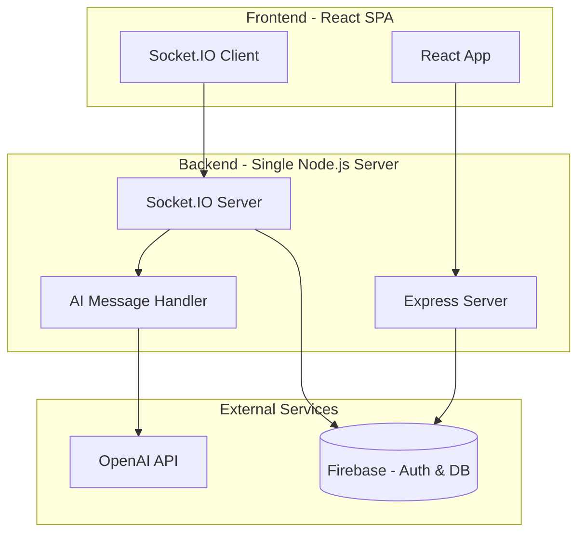

# Meme Battle Arena – 24-Hour Hackathon Architecture

## 🎯 Hackathon Goal
Build a **working demo** of a gamified AI-moderated debate platform in 24 hours that wows judges with:
- Real-time chat combat with HP mechanics
- AI-powered message analysis (wit vs. toxicity)
- Polished, animated UI
- Complete user flow from matching to battle end

---

## ⏱️ Time Allocation (24 Hours)

| Hours | Phase | Deliverables |
|-------|-------|--------------|
| **0-2** | Setup & Planning | Project structure, dependencies, mockups |
| **2-8** | Core Backend | Auth, Socket.IO, AI integration |
| **8-14** | Frontend UI | React app, battle arena, animations |
| **14-18** | Integration | Connect frontend ↔ backend, bug fixes |
| **18-21** | Polish | Styling, effects, edge cases |
| **21-23** | Demo Prep | Video recording, Devpost writeup |
| **23-24** | Buffer | Last-minute fixes, submission |

---

## 🏗️ Simplified Architecture



---

## 📦 Minimal Tech Stack

### Frontend
- **React** (Vite for fast setup)
- **Socket.IO Client** (real-time)
- **Framer Motion** (animations)
- **TailwindCSS** (rapid styling)
- **React Router** (navigation)

### Backend
- **Node.js + Express** (single server)
- **Socket.IO** (WebSocket)
- **OpenAI SDK** (GPT-4 for AI analysis)

### Database & Auth
- **Firebase** (auth + Firestore for data)
  - Why: Zero setup, free tier, real-time updates
  - Alternative: Skip auth entirely, use session storage

### Deployment
- **Vercel** (frontend - auto-deploy from GitHub)
- **Render** or **Railway** (backend - free tier)

---

## 🎮 Feature Scope (MVP Only)

### ✅ MUST HAVE (Core Demo)
1. **Landing Page** - Explain concept, "Start Battle" button
2. **Quick Match** - Click button → instant match (simulated or with bot)
3. **Battle Arena**:
   - Real-time chat interface
   - HP bars for both players (start at 100)
   - AI analyzes each message
   - Good messages → opponent loses HP
   - Toxic messages → you lose HP
   - Battle ends at 0 HP or 3-minute timer
4. **Winner Screen** - Show stats, replay option
5. **AI Moderation Visible** - Show wit score, toxicity score in UI

### ⚠️ NICE TO HAVE (If Time Permits)
- Swipe interface (can be 3-5 static cards)
- Multiple debate topics (5-10 presets)
- Sound effects
- Particle effects on strikes
- Profile page with stats

### ❌ SKIP FOR HACKATHON
- User registration/login (use guest mode)
- Leaderboards
- Power-ups
- Seasons
- Mobile app
- Advanced matchmaking algorithm
- Persistent user profiles

---

## 🗂️ Project Structure

```
meme-battle-arena/
├── frontend/
│   ├── src/
│   │   ├── components/
│   │   │   ├── BattleArena.jsx
│   │   │   ├── HealthBar.jsx
│   │   │   ├── ChatMessage.jsx
│   │   │   ├── StrikeEffect.jsx
│   │   │   └── WinnerScreen.jsx
│   │   ├── pages/
│   │   │   ├── Landing.jsx
│   │   │   └── Battle.jsx
│   │   ├── hooks/
│   │   │   └── useSocket.js
│   │   ├── App.jsx
│   │   └── main.jsx
│   ├── package.json
│   └── vite.config.js
├── backend/
│   ├── server.js
│   ├── ai-handler.js
│   ├── battle-manager.js
│   ├── package.json
│   └── .env
├── README.md
└── demo-assets/
    └── screenshots/
```

---

## 🔧 Implementation Plan (Hour-by-Hour)

### **Hour 0-2: Setup** ⚙️

**Tasks:**
- [ ] Create GitHub repo
- [ ] Initialize frontend: `npm create vite@latest frontend -- --template react`
- [ ] Initialize backend: `npm init -y` + install dependencies
- [ ] Set up Firebase project (or decide to skip auth)
- [ ] Get OpenAI API key
- [ ] Create quick Figma mockup (30 min) or skip to coding

**Dependencies to Install:**

Frontend:
```bash
npm install socket.io-client framer-motion react-router-dom
npm install -D tailwindcss postcss autoprefixer
```

Backend:
```bash
npm install express socket.io openai cors dotenv
npm install -D nodemon
```

---

### **Hour 2-8: Backend Core** 🔨

#### Hour 2-4: Basic Server + Socket.IO

**File: `backend/server.js`**
```javascript
const express = require('express');
const http = require('http');
const { Server } = require('socket.io');
const cors = require('cors');

const app = express();
app.use(cors());
app.use(express.json());

const server = http.createServer(app);
const io = new Server(server, {
  cors: { origin: '*' }
});

// In-memory battle state (no database needed for demo)
const battles = new Map();
const waitingPlayers = [];

io.on('connection', (socket) => {
  console.log('User connected:', socket.id);
  
  // Join battle queue
  socket.on('join-queue', () => {
    if (waitingPlayers.length > 0) {
      // Match with waiting player
      const opponent = waitingPlayers.shift();
      startBattle(socket, opponent);
    } else {
      // Wait for opponent
      waitingPlayers.push(socket);
      socket.emit('waiting');
    }
  });
  
  socket.on('disconnect', () => {
    console.log('User disconnected:', socket.id);
  });
});

server.listen(3000, () => {
  console.log('Server running on port 3000');
});
```

#### Hour 4-6: AI Integration

**File: `backend/ai-handler.js`**
```javascript
const OpenAI = require('openai');

const openai = new OpenAI({
  apiKey: process.env.OPENAI_API_KEY
});

async function analyzeMessage(message, topic) {
  try {
    const response = await openai.chat.completions.create({
      model: "gpt-4",
      messages: [{
        role: "system",
        content: `You are analyzing messages in a debate about "${topic}". 
        Rate the message on:
        1. Wit/humor (0-10)
        2. Relevance to topic (0-10)
        3. Toxicity (0-10, where 10 is extremely toxic)
        
        Respond ONLY with JSON: {"wit": X, "relevance": Y, "toxicity": Z}`
      }, {
        role: "user",
        content: message
      }],
      temperature: 0.3,
      max_tokens: 50
    });
    
    const analysis = JSON.parse(response.choices[0].message.content);
    
    // Determine strike type
    const isGoodStrike = analysis.toxicity < 3 && 
                        analysis.relevance > 6 && 
                        analysis.wit > 6;
    const isToxic = analysis.toxicity > 6;
    
    // Calculate damage
    let damage = 0;
    if (isGoodStrike) {
      damage = 10 + (analysis.wit - 6) * 5; // 10-30 damage
    } else if (isToxic) {
      damage = -20; // Self-damage
    }
    
    return {
      ...analysis,
      isGoodStrike,
      isToxic,
      damage
    };
  } catch (error) {
    console.error('AI analysis failed:', error);
    // Fallback: simple keyword check
    return fallbackAnalysis(message);
  }
}

function fallbackAnalysis(message) {
  const toxicWords = ['stupid', 'idiot', 'hate', 'kill'];
  const isToxic = toxicWords.some(word => message.toLowerCase().includes(word));
  
  return {
    wit: 5,
    relevance: 5,
    toxicity: isToxic ? 8 : 2,
    isGoodStrike: !isToxic && message.length > 20,
    isToxic,
    damage: isToxic ? -20 : 10
  };
}

module.exports = { analyzeMessage };
```

#### Hour 6-8: Battle Logic

**File: `backend/battle-manager.js`**
```javascript
const { analyzeMessage } = require('./ai-handler');

const TOPICS = [
  "Pineapple on pizza is a crime",
  "Cats are better than dogs",
  "The dress is blue and black",
  "GIF is pronounced with a hard G",
  "Cereal is a soup"
];

function startBattle(player1Socket, player2Socket) {
  const battleId = `battle-${Date.now()}`;
  const topic = TOPICS[Math.floor(Math.random() * TOPICS.length)];
  
  const battleState = {
    id: battleId,
    topic,
    players: {
      [player1Socket.id]: { hp: 100, strikes: 0 },
      [player2Socket.id]: { hp: 100, strikes: 0 }
    },
    messages: [],
    startTime: Date.now(),
    duration: 180000 // 3 minutes
  };
  
  // Join both players to battle room
  player1Socket.join(battleId);
  player2Socket.join(battleId);
  
  // Send battle start event
  const io = player1Socket.server;
  io.to(battleId).emit('battle-start', {
    battleId,
    topic,
    opponent: {
      [player1Socket.id]: player2Socket.id,
      [player2Socket.id]: player1Socket.id
    }
  });
  
  // Handle messages
  const handleMessage = async (socket, message) => {
    const analysis = await analyzeMessage(message, topic);
    const senderId = socket.id;
    const opponentId = senderId === player1Socket.id ? 
                       player2Socket.id : player1Socket.id;
    
    // Update HP
    if (analysis.isGoodStrike) {
      battleState.players[opponentId].hp -= analysis.damage;
    } else if (analysis.isToxic) {
      battleState.players[senderId].hp += analysis.damage; // damage is negative
    }
    
    // Broadcast message and update
    io.to(battleId).emit('battle-message', {
      senderId,
      message,
      analysis,
      state: battleState.players
    });
    
    // Check win condition
    if (battleState.players[player1Socket.id].hp <= 0 || 
        battleState.players[player2Socket.id].hp <= 0) {
      endBattle(io, battleId, battleState);
    }
  };
  
  player1Socket.on('send-message', (msg) => handleMessage(player1Socket, msg));
  player2Socket.on('send-message', (msg) => handleMessage(player2Socket, msg));
  
  // Timer
  setTimeout(() => {
    endBattle(io, battleId, battleState);
  }, battleState.duration);
}

function endBattle(io, battleId, battleState) {
  const [p1Id, p2Id] = Object.keys(battleState.players);
  const winner = battleState.players[p1Id].hp > battleState.players[p2Id].hp ? 
                 p1Id : p2Id;
  
  io.to(battleId).emit('battle-end', {
    winner,
    finalState: battleState.players
  });
}

module.exports = { startBattle };
```

---

### **Hour 8-14: Frontend** 🎨

#### Hour 8-10: Basic React Setup + Routing

**File: `frontend/src/App.jsx`**
```javascript
import { BrowserRouter, Routes, Route } from 'react-router-dom';
import Landing from './pages/Landing';
import Battle from './pages/Battle';

function App() {
  return (
    <BrowserRouter>
      <Routes>
        <Route path="/" element={<Landing />} />
        <Route path="/battle" element={<Battle />} />
      </Routes>
    </BrowserRouter>
  );
}

export default App;
```

#### Hour 10-12: Battle Arena UI

**File: `frontend/src/pages/Battle.jsx`**
```javascript
import { useState, useEffect } from 'react';
import { useSocket } from '../hooks/useSocket';
import HealthBar from '../components/HealthBar';
import ChatMessage from '../components/ChatMessage';
import StrikeEffect from '../components/StrikeEffect';

export default function Battle() {
  const socket = useSocket();
  const [battleState, setBattleState] = useState(null);
  const [messages, setMessages] = useState([]);
  const [input, setInput] = useState('');
  const [myId, setMyId] = useState(null);
  
  useEffect(() => {
    if (!socket) return;
    
    setMyId(socket.id);
    socket.emit('join-queue');
    
    socket.on('battle-start', (data) => {
      setBattleState({
        topic: data.topic,
        myHp: 100,
        opponentHp: 100,
        opponentId: data.opponent[socket.id]
      });
    });
    
    socket.on('battle-message', (data) => {
      setMessages(prev => [...prev, data]);
      // Update HP
      setBattleState(prev => ({
        ...prev,
        myHp: data.state[socket.id].hp,
        opponentHp: data.state[prev.opponentId].hp
      }));
    });
    
    socket.on('battle-end', (data) => {
      // Show winner screen
      alert(data.winner === socket.id ? 'You Win!' : 'You Lose!');
    });
  }, [socket]);
  
  const sendMessage = () => {
    if (input.trim()) {
      socket.emit('send-message', input);
      setInput('');
    }
  };
  
  if (!battleState) {
    return <div className="loading">Finding opponent...</div>;
  }
  
  return (
    <div className="battle-arena">
      <div className="topic">Topic: {battleState.topic}</div>
      
      <div className="health-bars">
        <HealthBar label="You" hp={battleState.myHp} />
        <HealthBar label="Opponent" hp={battleState.opponentHp} />
      </div>
      
      <div className="messages">
        {messages.map((msg, i) => (
          <ChatMessage 
            key={i} 
            message={msg} 
            isMe={msg.senderId === myId}
          />
        ))}
      </div>
      
      <div className="input-area">
        <input 
          value={input}
          onChange={(e) => setInput(e.target.value)}
          onKeyPress={(e) => e.key === 'Enter' && sendMessage()}
          placeholder="Type your witty response..."
        />
        <button onClick={sendMessage}>Send</button>
      </div>
    </div>
  );
}
```

#### Hour 12-14: Components (HealthBar, ChatMessage)

**File: `frontend/src/components/HealthBar.jsx`**
```javascript
import { motion } from 'framer-motion';

export default function HealthBar({ label, hp }) {
  const percentage = Math.max(0, hp);
  const color = hp > 60 ? '#10b981' : hp > 30 ? '#f59e0b' : '#ef4444';
  
  return (
    <div className="health-bar-container">
      <div className="label">{label}</div>
      <div className="bar-background">
        <motion.div 
          className="bar-fill"
          style={{ backgroundColor: color }}
          animate={{ width: `${percentage}%` }}
          transition={{ duration: 0.5 }}
        />
      </div>
      <div className="hp-text">{hp} HP</div>
    </div>
  );
}
```

---

### **Hour 14-18: Integration & Bug Fixes** 🔗

- [ ] Connect frontend to backend (test Socket.IO connection)
- [ ] Test full battle flow with 2 browser windows
- [ ] Fix any race conditions or state bugs
- [ ] Add error handling (AI fails, socket disconnects)
- [ ] Test with different message types

---

### **Hour 18-21: Polish** ✨

#### Visual Enhancements:
- [ ] Add strike animations (screen shake, particles)
- [ ] Smooth HP bar transitions
- [ ] Message bubbles with different colors for good/toxic strikes
- [ ] Victory/defeat animations
- [ ] Background gradients
- [ ] Sound effects (optional)

#### TailwindCSS Styling:
```css
/* Add dark theme with vibrant accents */
.battle-arena {
  @apply min-h-screen bg-gradient-to-br from-purple-900 via-gray-900 to-cyan-900;
}

.health-bar-container {
  @apply bg-gray-800 rounded-lg p-4 shadow-xl;
}

.message-good-strike {
  @apply bg-green-500 text-white animate-pulse;
}

.message-toxic {
  @apply bg-red-500 text-white shake;
}
```

---

### **Hour 21-23: Demo Prep** 🎬

#### Record Demo Video (2-3 minutes):
1. **Intro (20s)**: "Online debates get toxic. We built an AI that gamifies wit."
2. **Demo (90s)**:
   - Show landing page
   - Click "Start Battle"
   - Show matching
   - Enter battle arena
   - Send witty message → opponent HP drops
   - Send toxic message → your HP drops
   - Show AI scores in UI
   - Battle ends, winner screen
3. **Tech (30s)**: "Built with React, Node.js, Socket.IO, and GPT-4"
4. **Outro (20s)**: "Future: tournaments, mobile app, voice battles"

#### Write Devpost Description:
- **Inspiration**: Tired of toxic online debates
- **What it does**: Gamifies debates with AI moderation
- **How we built it**: React, Node.js, Socket.IO, OpenAI GPT-4
- **Challenges**: Real-time AI analysis latency, balancing game mechanics
- **Accomplishments**: Working AI moderation in 24 hours!
- **What we learned**: WebSocket scaling, prompt engineering
- **What's next**: Mobile app, tournaments, voice battles

#### Take Screenshots:
- Landing page
- Battle arena (mid-battle)
- Health bars at different HP levels
- Winner screen
- AI analysis visible in UI

---

### **Hour 23-24: Buffer & Submit** 🚀

- [ ] Final bug testing
- [ ] Deploy frontend to Vercel
- [ ] Deploy backend to Render
- [ ] Update README with live demo link
- [ ] Submit to Devpost
- [ ] Celebrate! 🎉

---

## 🎯 Success Metrics

**Minimum Viable Demo:**
- ✅ Two users can battle in real-time
- ✅ AI analyzes messages and updates HP
- ✅ Battle ends with winner/loser
- ✅ UI looks polished (not a prototype)
- ✅ Demo video shows complete flow

**Bonus Points:**
- Visible AI scores (wit, relevance, toxicity)
- Animated strike effects
- Multiple topics
- Sound effects
- Mobile responsive

---

## 🚨 Risk Mitigation

| Risk | Mitigation |
|------|------------|
| **OpenAI API slow** | Cache responses, add fallback keyword analysis |
| **Socket.IO bugs** | Test early with 2 browser windows |
| **Styling takes too long** | Use TailwindUI components, skip custom animations |
| **Deployment fails** | Test deployment at hour 18, have backup plan |
| **AI costs too much** | Set OpenAI rate limits, use GPT-3.5-turbo instead |

---

## 💡 Pro Tips

1. **Use AI to code faster**: Use ChatGPT/Claude to generate boilerplate
2. **Don't reinvent the wheel**: Copy-paste Socket.IO examples
3. **Test continuously**: Don't wait until hour 20 to test integration
4. **Commit often**: Push to GitHub every 2 hours
5. **Skip auth**: Use guest mode or hardcoded users
6. **Fake it if needed**: If matchmaking is buggy, match with a bot
7. **Record video early**: Have a backup recording at hour 20

---

## 📚 Resources

**Quick Start Templates:**
- Vite React: `npm create vite@latest`
- Socket.IO docs: https://socket.io/docs/v4/
- OpenAI Node SDK: https://github.com/openai/openai-node
- Framer Motion: https://www.framer.com/motion/

**Deployment:**
- Vercel: Connect GitHub, auto-deploy
- Render: Free tier, supports WebSockets
- Railway: Alternative to Render

---

## 🏆 Judging Pitch

**"We built Pokémon battles for debates."**

- Real-time combat where **wit is your weapon**
- AI judges every message for humor, relevance, and toxicity
- Good arguments damage your opponent
- Toxic messages damage yourself
- Built in 24 hours with React, Node.js, and GPT-4

**The future of online discourse is gamified, AI-moderated, and fun.**

---

**Good luck! You've got this! 🚀**
